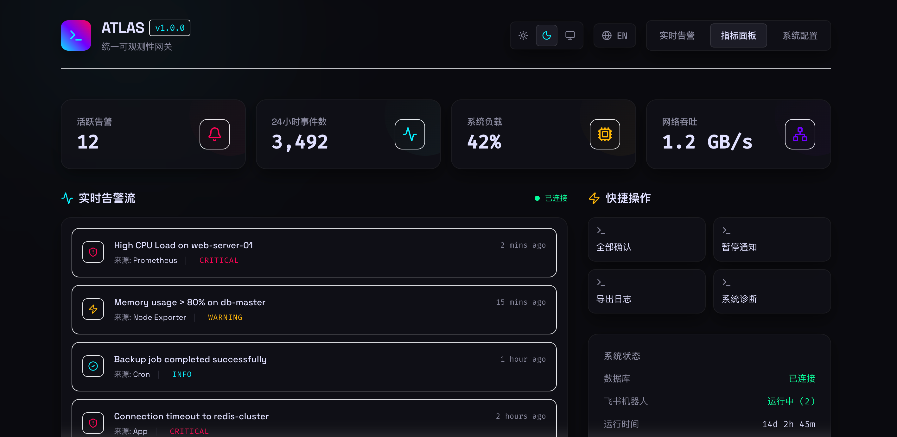

# Atlas

<div align="center">
  <h3>统一可观测性与可靠性网关 (Unified Observability Gateway)</h3>
  <p>一个轻量级、高性能的网关，用于集中处理告警、指标采集以及智能化运维分析。</p>
</div>

***

## 📖 项目简介



**Atlas** 旨在成为你基础设施可观测性技术栈的中心枢纽。它作为一个统一网关，接收来自各种数据源（如 Prometheus、Node Exporter、自定义应用）的数据，进行降噪、分析后，智能路由到指定的通知渠道（如飞书/钉钉），同时提供一个现代化的实时监控大屏。

未来，Atlas 将逐步演进为一个包含 AI 辅助诊断、SOP 联动与硬件健康评估的**综合可靠性平台**。

## ✨ 当前特性

- **统一数据接入**: 接收来自 Prometheus Alertmanager、Grafana 以及自定义应用的 Webhook 告警和指标推送。
- **智能告警路由**: 内置告警去重、降噪逻辑，并支持将处理后的告警智能路由到多个机器人。
- **飞书/Lark 原生集成**: 深度集成飞书机器人，支持富文本交互卡片，并内置安全签名校验。
- **现代化仪表盘**: 采用 Tailwind CSS 构建的“科技极简”风格大屏，支持中英文切换及浅色/深色主题无缝切换。
- **极致轻量**: 后端由 Go 编写，内置 SQLite 数据库，零复杂依赖，单二进制文件即可完成部署。

## 🚀 路线图与规划功能 (Roadmap)

除了目前已实现的告警增强与分发功能外，项目正在积极规划以下核心能力：

- 🛠 **故障处理 SOP 联动**: 告警触发时，自动匹配并推荐标准操作程序（SOP），甚至支持一键执行常见恢复脚本。
- 📝 **故障日志智能收集**: 在发生告警的瞬间，自动采集相关节点或容器的错误日志与异常堆栈，保存快照以供复盘。
- 🤖 **AI 故障分析**: 引入大语言模型（LLM），基于历史告警、日志快照和知识库，自动生成故障根因分析报告（RCA）。
- 🖥️ **硬件健康评分**: 结合多维度的硬件指标（CPU、内存、磁盘寿命等），动态计算并输出节点的综合硬件健康度评分，提前发现隐患。

## � 快速开始

### 环境要求

- Go 1.21+
- Node.js 18+ (用于前端 Web UI 开发)

### 1. 编译并运行服务端

```bash
# 编译 Go 后端服务 (网关 + API + 分析引擎集成在同一个二进制文件中)
go build -o bin/atlas-server cmd/server/main.go

# 运行服务
./bin/atlas-server
```

### 2. 修改配置

编辑 `configs/config.yaml`，配置数据库、端口以及飞书机器人的 Webhook。

```yaml
gateway:
  port: ":8080"
storage:
  dsn: "atlas.db"
feishu:
  bots:
    - enabled: true
      webhook_url: "https://open.feishu.cn/open-apis/bot/v2/hook/YOUR_WEBHOOK_URL"
      enable_signature: false
      secret: ""
```

### 3. 运行前端 UI

```bash
cd web
npm install
npm run dev
```

## 📡 API 接口说明

- `POST /api/v1/webhook/alert` - 接收外部告警推送 (例如 Prometheus Alertmanager)
- `GET /api/v1/status` - 系统健康与状态检查

## 🛠 技术栈

- **后端**: Go, SQLite, GORM
- **前端**: React, Vite, Tailwind CSS, Framer Motion, i18next (支持中英文双语)
- **设计风格**: 科技极简风

## 📄 许可证

MIT License
