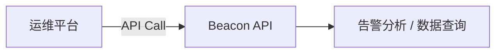
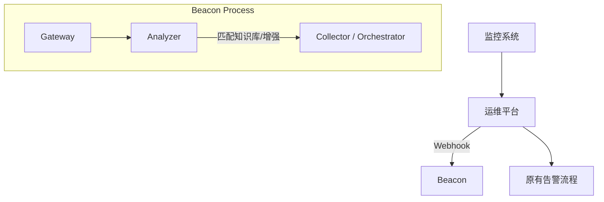

# Beacon

**Beacon** 是一个用于增强运维平台能力的 SRE 自动化与硬件可靠性平台。它不替代现有运维平台，而是作为 **运维能力增强层**，旨在解决告警信息不足、故障日志分散、硬件健康缺乏评估以及故障缺乏自动化处理能力等痛点。

## 项目目标

Beacon 旨在解决以下问题：
- 告警信息不足，排查困难
- 故障日志分散，难以收集
- 硬件健康状态缺乏统一评估
- 故障缺乏自动化处理能力
- 运维知识沉淀不足

通过 Beacon 可以实现：
- **告警智能分析**：英文告警翻译、故障原因标注、处理建议生成。
- **自动采集故障日志**：自动收集 syslog, dmesg, nvidia-smi 等关键日志。
- **自动执行运维操作**（可选）：自动重启、隔离故障节点等。
- **运维知识沉淀（增强版）**：升级为 Ops Knowledge Platform，支持故障案例记录、复盘、SOP 及告警自动关联。
- **服务器硬件健康评分（增强版）**：基于历史数据评估服务器硬件健康状态。
- **AI Agent 辅助运维**（可选）：基于 AI 模型自动执行运维操作，如重启、隔离故障节点等。

## 系统架构

Beacon 支持两种数据交互方式：

### 1. Pull 模式 (运维平台调用 Beacon)
运维平台通过 API 主动调用 Beacon 获取数据：

示例接口：
- `GET /api/alerts`
- `GET /api/node/health`
- `GET /api/fault/logs`

### 2. Push 模式 (Beacon 主动接收告警)
运维平台将告警 webhook 同步发送到 Beacon，Beacon 处理后可能反向推送结果或执行操作：


## 核心功能

### 告警增强
Beacon 可以对告警进行增强，提供翻译、原因分析和处理建议。
**示例**：
- **原始告警**: `GPU Xid 79 detected`
- **增强后**:
    - **原因**: `GPU fallen off the bus`
    - **建议**: 
        1. `reboot node`
        2. `检查 PCIe`

### 故障日志自动采集
当 Analyzer 识别到关键告警时，Collector 模块会自动采集并打包故障日志，包括：
- `syslog`
- `dmesg`
- `nvidia-smi`
- `lspci`
- `kernel panic` / `kdump`

### 硬件健康评分
Beacon 为每台服务器计算健康评分（示例）：
- **Node-01**
    - GPU: 90
    - Disk: 95
    - Network: 98
    - **Total Score: 94**

### 故障预测 (Phase 3)
基于历史指标数据（XID 次数、温度趋势、ECC 错误等）预测硬件故障概率。

## 项目目录结构

```
beacon
│
├── cmd                  # 各服务启动入口（main程序）
│   ├── gateway          # Beacon 事件入口服务
│   ├── api              # Beacon 对外 API 服务
│   └── agent            # 节点 Agent
│
├── internal             # Beacon 核心业务逻辑模块（不对外暴露）
│   ├── gateway          # 事件入口模块（Webhook接收、告警解析、队列分发）
│   ├── agent            # 节点侧 Agent 逻辑（硬件信息/指标采集、系统事件监听）
│   ├── analyzer         # 告警分析引擎（解析告警、匹配知识库、生成建议）
│   ├── collector        # 故障日志采集模块（调用agent采集日志、打包数据）
│   ├── orchestrator     # 自动化运维执行引擎（执行远程任务、重启/隔离节点）
│   ├── health           # 硬件健康评分模块（计算 Node/GPU/Disk 健康分）
│   └── predictor        # 故障预测模块（分析历史数据、预测故障概率）
│
├── pkg                  # 公共模块库（可被外部引用）
│   ├── storage          # 数据存储访问层（告警、日志、健康分数据存取）
│   ├── api              # Beacon API 定义（REST/gRPC 接口定义）
│   └── knowledge        # 故障知识库模块（常见故障模式、处理建议存储）
│
├── web                  # Beacon Web UI（告警展示、日志查看、健康评分看板）
└── deploy               # 部署配置 (Dockerfile, K8s YAML, Helm charts)
```

## Roadmap (路线图)

Beacon 的演进分为三个阶段，贯穿始终的核心能力是 **运维知识沉淀 (Ops Knowledge Base)**。

### Phase 1：基础能力（告警增强与故障采集）
**周期建议**: 1 ~ 2 个月
**目标**: 提升告警可读性与故障排查效率
**核心模块**: `gateway`, `analyzer`, `collector`, `knowledge`, `api`

1.  **告警增强**: 实现英文翻译、故障原因标注、处理建议添加。
2.  **GPU XID 故障分析**: 内置 GPU XID 知识库（原因、官方建议、运维建议）。
3.  **故障日志自动采集**: 关键告警触发自动采集 (syslog, dmesg, nvidia-smi 等) 并打包。
4.  **运维知识沉淀（初始版）**: 建立故障类型、原因、处理建议的结构化存储。

### Phase 2：可靠性平台（硬件可靠性与运维自动化）
**周期建议**: 2 ~ 4 个月
**目标**: 构建硬件可靠性能力
**新增模块**: `agent`, `health`, `orchestrator`

1.  **节点 Agent**: 部署在服务器节点，采集系统/GPU指标 (温度, ECC, etc.) 并上报。
2.  **硬件健康评分**: 基于采集指标计算 Node/GPU/Disk 健康分。
3.  **自动化运维（可选）**: 实现自动重启节点、自动隔离故障服务器、自动迁移任务等操作。
4.  **运维知识沉淀（增强版）**: 升级为 Ops Knowledge Platform，支持故障案例记录、复盘、SOP 及告警自动关联。

## Phase 3：AI SRE
**周期建议**: 6 个月以上
**目标**: 构建智能运维能力
**新增模块**: `predictor`, `ai-analyzer` (未来)

随着 **Ops Knowledge Base** 的不断丰富和历史数据的积累，Beacon 将从“辅助运维”向“自治运维”演进，接入 **AI Agent**。

**AI Agent 运维助手 愿景**:
- **Copilot -> Agent**: 从“人问 AI 答”转变为“AI 自主决策、人来监督”。
- **知识驱动**: 基于沉淀的故障案例和 SOP，Agent 可以自主推理并执行复杂的故障恢复流程。

**场景示例**:
1. **自主故障闭环**: 
   - 监测到异常 -> Agent 分析 Root Cause -> 检索知识库 SOP -> 制定修复计划 -> (人工审批) -> 自动执行 -> 验证恢复。
2. **主动巡检与优化**:
   - Agent 定期巡检集群状态，主动发现潜在隐患（如配置漂移、资源浪费）并提出优化建议。
3.  **硬件监控评分**: 基于历史数据评估计算 Node/GPU/Disk 等硬件的健康分，评估集群整体运行状态。
4.  **AI 告警分析**: 使用 AI 分析 alert/syslog/dmesg，输出 root cause 和 risk level。
5.  **AI 运维助手**: 提供运维 Copilot，支持自然语言问答交互（e.g., "node-23 为什么频繁 GPU XID?"）

## 运维知识沉淀 (核心资产)

Beacon 的长期核心价值在于 **运维经验结构化**：将脑子里的经验转化为系统里的知识库，再演进为自动化和 AI 能力。

**Ops Knowledge Base 内容**:
- **故障知识**: GPU XID, Kernel Panic, Disk IO error 等标准故障模式。
- **故障案例**: 记录故障时间、影响范围、处理过程、解决方案。
- **运维 SOP**: 标准化处理流程（如 GPU 故障处理、服务器重启检查）。
- **自动关联**: 实现 "告警 -> 自动匹配知识库 -> 显示解决方案" 的闭环。


## 部署

Beacon 支持 Docker, Kubernetes, Helm 等多种部署方式，配置文件位于 `deploy/` 目录。

## 仓库地址

GitLab: [http://10.255.151.17:9091/sre/beacon.git](http://10.255.151.17:9091/sre/beacon.git)
