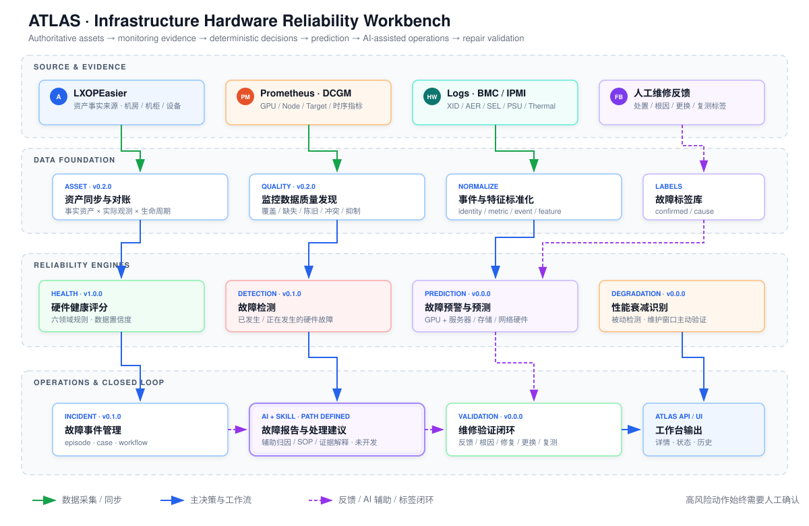

# Atlas

  <h3>Infrastructure Hardware Reliability Workbench</h3>
  
Discover infrastructure issues earlier, understand them clearly, and turn every resolution into reusable reliability knowledge.

  

    
    
  

  

    English · <a href="README_zh.md">简体中文</a>
  

---

## Overview

Atlas is a reliability workbench for GPU clusters, with a path toward broader server, storage, and network infrastructure coverage. It brings asset state, telemetry, hardware issues, and operational experience into one place, helping teams build a closed loop from discovery and assessment to resolution and verification.

Atlas is under active development. Available capabilities are continuously refined, and early-stage capabilities may evolve between releases.

## Capabilities

| Area | What Atlas provides | Status |
| --- | --- | --- |
| Fleet & assets | Unified visibility into infrastructure inventory, state, and monitoring coverage | Available, continuously evolving |
| Hardware health | Explainable GPU health and risk signals based on complementary telemetry | Available, continuously evolving |
| Data quality | Detection of missing collection, interrupted series, identity drift, and coverage gaps | Available, continuously evolving |
| Alert center | Centralized hardware alerts, evidence, detail views, and resolution status | Available, continuously evolving |
| Issue analytics | Statistics for discovered, resolved, and outstanding issues with drill-down by category | Available, continuously evolving |
| Resolution knowledge | Human-authored causes, solutions, procedures, and outcomes for future reuse | Available, continuously evolving |
| Performance validation | Performance change analysis and post-maintenance verification workflows | Early access, continuously evolving |
| Rules & intelligent analysis | Rules, feature foundations, and operational knowledge working together | Early access, continuously evolving |
| Platform configuration | Environment-specific product identity and presentation settings | Available, continuously evolving |

## Platform Architecture

The platform organizes evidence, data foundations, reliability capabilities, and operational workflows into a single product view.

## Product Principles

- Ground every assessment in real assets and traceable evidence.
- Distinguish hardware faults, data-quality issues, and unknown states.
- Keep consequential operations under human control; Atlas does not autonomously drain workloads or isolate nodes.
- Preserve the evidence behind every assessment and turn every resolution into reusable knowledge.
- Keep capabilities explainable, testable, and open to continuous improvement.

## Project Status

Atlas is being developed iteratively. The current focus is to strengthen the end-to-end reliability workflow while expanding the quality, prediction, validation, and knowledge capabilities behind it. Capability labels in this README describe product maturity rather than a fixed release promise.

## Contributing

Issues and pull requests are welcome. Before proposing a large change, please open an issue to align on its product scope, user impact, and validation approach. Do not include credentials, private infrastructure addresses, customer data, or other sensitive operational information in public submissions.

## Security

Please do not disclose security vulnerabilities through a public issue. Report them privately to the project maintainers with reproduction steps and the affected version.

## License

Atlas is released under the [MIT License](LICENSE).
