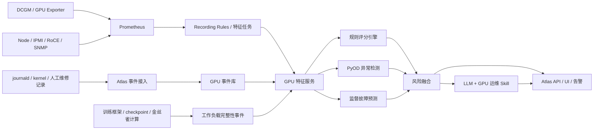

# Atlas GPU 健康评分与故障预测开发蓝图 v1.4

> 状态：开发基线草案
>
> 现场基线日期：2026-07-15
>
> 适用范围：GPU 卡健康评分、GPU 故障检测与故障前预警
>
> 后续扩展：服务器、存储、网络及其他基础设施健康评分

## 1. 文档目的

本文档是 Atlas GPU 健康能力的开发蓝图，用于统一后续产品、数据、算法、后端、前端和运维实施方向。

正式产品定位：

> **ATLAS — Infrastructure Hardware Reliability Workbench**  
> ATLAS 是面向 GPU 集群并可扩展至服务器、存储和网络基础设施的硬件可靠性工作台，提供资产对账、监控数据质量发现、硬件健康评分、故障检测、硬件故障预警与预测、性能衰减识别、故障事件管理以及维修验证闭环。

平台按能力模块独立迭代和发布版本，当前模块状态、版本与迭代记录以 [平台能力模块与版本基线](platform-capability-modules.md) 为准。

事件接收链路、故障事件分层、故障特征库和性能衰减特征的实施细节，以 [事件链路与故障特征库实施方案](event-pipeline-and-fault-feature-catalog-plan.md) 为准。

本文档重点回答：

- 第一阶段要交付什么，以及明确不做什么
- 如何复用现有 Prometheus、DCGM、GPU Exporter、Node Exporter、IPMI 和网络遥测
- 如何实现可解释的 GPU 健康评分
- 如何实现 XID、ECC、掉卡和 GPU 不可用检测
- 如何识别可用但算力、带宽或多卡效率显著衰减的 GPU 灰色故障
- 如何补充 GPU 静默数据损坏（SDC）的工作负载完整性检测
- 哪些故障可能提前预警，哪些故障只能快速检测
- PyOD、大模型和 Skill 分别处于哪一层
- 如何在不接入调度系统的前提下安全采集硬件数据和执行人工维护验证
- 每个开发阶段的任务、产物、验收指标和退出条件
- 如何把告警、隔离、诊断、维修、验证和重新上线形成闭环

## 2. 总体结论

Atlas 采用以下演进路线：

```text
现有遥测与日志
    -> 数据治理与事件化
    -> 确定性规则评分
    -> 统计基线与异常检测
    -> 故障标签闭环
    -> 监督式故障预测
    -> LLM 解释、归因、SOP 与知识沉淀
```

核心原则：

1. 健康评分、异常分数、故障概率必须是三个独立概念。
2. 第一阶段以规则评分和快速故障检测为主，不用大模型直接决定分数。
3. PyOD 用于异常检测，不直接输出未经校准的故障概率。
4. 只有在真实故障标签足够后，监督模型才能输出未来故障概率。
5. 所有结论必须能回溯到原始指标、日志事件、规则或模型版本。
6. 在途 GPU 计算任务优先，禁止自动运行可能影响任务的诊断、重置或压力测试。
7. 平台核心能力不仅是预测，还包括已发生故障、性能衰减和告警处置闭环。

### 2.1 监控数据模式与数据质量职责

Atlas 不以 SSH、BMC 或节点 Agent 权限作为基础运行前提。对于无法登录节点、只能读取既有监控数据的集群，平台仍应基于 Prometheus 指标、active targets、时序连续性、标签一致性、同类对比和资产对账完成：

- 识别节点或 exporter 未被有效监控、Target DOWN/MISSING、指标缺失或长期不更新
- 识别 UUID、节点、槽位、型号和 PCI Bus ID 的映射冲突与漂移
- 区分硬件异常、采集链路异常、指标不支持和数据不足，避免将监控问题误报为 GPU 故障
- 输出问题对象、原因码、影响范围、首次/最近时间和建议核查动作

平台在这一模式下承担“发现、定位、记录、验证”职责，不自动修改 exporter、Prometheus 配置或节点。获得节点/BMC 只读权限后可以补充日志和带外证据，但这些权限是增强能力，不是数据质量发现的必要条件。

### 2.2 资产事实源与观测资产

[LXOPEasier](https://10.111.201.1:7090/) 的机房、机柜和设备资产是当前环境的资产事实来源。Atlas 不替代 LXOPEasier 的资产主数据职责，而是维护监控侧观测资产，并完成双向差异发现：

- 从 LXOPEasier 同步节点、机房、机柜、设备身份和生命周期状态
- 从 Prometheus/DCGM 观测实际 Target、GPU 槽位、UUID、型号和在线状态
- 对比事实资产与实际观测，输出新增、替换、下架、缺失、身份冲突和状态不一致
- 当前已经形成 90 节点/720 卡的监控侧基线；LXOPEasier 接口同步为待接入能力，不描述为已经完成

## 3. 已验证现场基线

以下是 2026-07-15 对现有监控环境进行只读核查得到的基线，不代表长期固定配置。

### 3.1 服务与存储

| 项目                     | 当前状态                 |
| ---------------------- | -------------------- |
| Atlas 服务               | 内网端口 `7077`          |
| Prometheus             | `2.54.0`，内网端口 `9090` |
| GPU 指标抓取周期             | `15s`                |
| Prometheus 配置留存        | `5y`                 |
| Prometheus Head Series | 约 `1,035,184`        |
| Prometheus TSDB Blocks | 约 `6.18 TB`          |

结论：现有 Prometheus 已承载较大规模数据，Atlas 不应频繁发起全量、长时间范围、高基数的临时 PromQL 查询。应通过 recording rules 或独立特征任务预聚合。

### 3.2 GPU 规模

2026-07-17 资产文档与监控对账确认 `90` 个 GPU 节点、`720` 个预期物理槽位。当前实时 DCGM 提供 `704` 个 UUID，另从 365 天历史数据恢复 `16` 个 UUID。GPU 资产范围以资产文档主机名包含 `gpu`（不区分大小写）为准；`10.114.4.37` 不满足该条件，不进入 GPU 资产域。

| GPU 型号                  | 已知 UUID | 预期槽位 | 8 卡机器数 |
| ----------------------- | ------: | -----: | ----: |
| NVIDIA GeForce RTX 4090 |     272 |    272 |    34 |
| NVIDIA H100 80GB HBM3   |     384 |    384 |    48 |
| NVIDIA H200             |      64 |     64 |     8 |
| 合计                      |     720 |    720 |    90 |

节点状态：`89 UP`、`1 REACHABLE`（`10.114.4.25`，节点可达但三个 target 缺失）。资产规模不得从当前在线 DCGM 数量反推，避免节点或 exporter DOWN 后资产消失。

### 3.3 Exporter 覆盖

以下只统计 `90` 个 GPU 节点；其他非 GPU 服务器 target 不进入 GPU 覆盖率。

| 采集器           |  Up | Down | Missing |
| ------------- | --: | ---: | ------: |
| DCGM Exporter |  88 |    1 |       1 |
| GPU Exporter  |  78 |   11 |       1 |
| Node Exporter |  89 |    0 |       1 |
| IPMI Exporter |  90 |    0 |       0 |

已存在的主要数据源：

- DCGM GPU 指标
- `nvidia-smi`/NVML 补充指标
- Node Exporter 主机指标
- IPMI 温度、电压、风扇和功耗
- InfiniBand/RoCE 遥测
- SNMP 网络设备指标
- Blackbox 网络连通性指标

补充现场条件：GPU 节点的 BMC/IPMI 均具备登录和查询条件，可作为 GPU 供电、风扇、进出风温度、整机功耗、PSU、PCIe 槽位以及服务器硬件事件的带外证据源。平台只通过集中管理的只读凭据采集，不在代码、文档或告警中保存明文密码。现有 `IPMI Exporter 104 up / 2 down` 与 GPU 节点清单仍需逐台对齐，避免把“可登录”误当成“持续采集正常”。

### 3.4 当前主要数据缺口

- XID 缺少完整、可靠、逐事件的内核日志事件流
- 当前 `DCGM_FI_DEV_XID_ERRORS` 可能长期保存最近一次 XID，不能作为实时事件直接使用
- 自定义 `gpu_xid_*` 指标覆盖不足，不能作为唯一 XID 数据源
- 项目责任边界不包含调度任务上下文；硬件健康结论不得依赖该数据，业务吞吐类结论相应降级
- 缺少维修、更换、重启、驱动修复和误报确认等故障标签
- 不同 GPU 型号的指标支持能力尚未形成正式能力矩阵
- DCGM 不支持值和空值哨兵尚未在 Atlas 侧统一治理
- 当前缺少针对算力、显存带宽、PCIe/NVLink 带宽和多卡 straggler 的独立衰减告警
- BMC/IPMI 传感器和 SEL 事件尚未与 GPU UUID、PCIe 槽位及故障工单形成统一关联

## 4. 能力边界

### 4.1 产品需要输出的三个核心值

| 输出                      | 含义                     | 第一阶段      |
| ----------------------- | ---------------------- | --------- |
| `health_score`          | 当前健康状态，范围 0～100        | 必须实现      |
| `anomaly_score`         | 相对历史和同类群体的异常程度         | PyOD 阶段实现 |
| `failure_probability_*` | 未来 1h/6h/24h 发生故障的校准概率 | 标签成熟后实现   |

同时输出：

- `data_confidence`：数据是否完整、指标是否受支持、基线是否成熟
- `health_level`：healthy/info/warning/high\_risk/critical/unknown
- `risk_domains`：thermal/power/memory/pcie/nvlink/stability/performance
- `evidence`：扣分或预测依据
- `recommended_actions`：建议动作，不自动执行
- `performance_status`：unknown/normal/suspected/confirmed，表示是否存在性能衰减
- `performance_ratio`：在可比基线下的实际性能比值，不满足可比条件时为空

### 4.2 故障检测与硬件故障预警/预测边界

| 场景                 | 故障后检测能力目标                         | 故障前预警潜力                        |
| ------------------ | --------------------------------- | ------------------------------ |
| GPU 不可用            | 强，目标 60 秒内发现                      | 弱，取决于是否存在间歇失联前兆                |
| 掉卡/XID 79          | 强，精确到 UUID 和 PCI Bus ID           | 弱到中等，部分故障无前兆                   |
| ECC DBE/XID 48     | 强                                 | H100/H200 中等；4090 不具备等价 ECC 能力 |
| XID 13/31 等应用错误    | 强                                 | 很弱，通常不属于可预测硬件退化                |
| 高温和散热退化            | 强                                 | 强，通常可提前数十分钟到数天发现趋势             |
| 功耗或供电异常            | 较强                                | 中等                             |
| PCIe 链路退化          | 较强                                | 中等                             |
| NVLink/NVSwitch 故障 | H100/H200 较强                      | 中等                             |
| 算力/带宽衰减（灰色故障）      | 中等到强，取决于可比 workload 或主动 benchmark | 不作为首版预测目标；可监测退化趋势              |
| 突发硬件死亡             | 强                                 | 很弱或不可预测                        |

故障检测用于确认已经发生或正在发生的问题；硬件故障预警与预测用于评估故障发生前的风险与概率，覆盖 GPU，并沿统一资产、特征和标签模型扩展到服务器、存储和网络硬件。两者必须分别验收，不得用检测结果代替预测结果。

### 4.3 静默数据损坏（SDC）的边界

LLM-PRISM、AEGIS 等研究说明，永久或间歇性 GPU 故障可能产生没有 XID、掉卡或明显 loss 异常的错误计算。仅靠 DCGM、NVML、Prometheus 和系统日志，不能宣称完整覆盖 SDC。

当前项目只负责硬件侧，不接入训练任务、loss、梯度或 checkpoint。工作负载完整性面仅保留扩展接口和研究参考，不属于当前交付范围，也不阻塞 GPU 硬件健康、故障检测和维修闭环。

因此产品拆成两个相互关联、但分别输出结论的检测面：

| 检测面      | 主要证据                                            | 输出                                  | 边界                          |
| -------- | ----------------------------------------------- | ----------------------------------- | --------------------------- |
| 硬件健康面    | DCGM、XID、ECC、PCIe、温度、功耗、掉卡、驱动日志                 | `health_score`、硬件事件、故障概率            | 能发现显性硬件故障和部分退化前兆，不能覆盖全部错误计算 |
| 工作负载完整性面 | loss/梯度范数、NaN/Inf、checkpoint 校验、金丝雀计算、复算差异、任务基线 | `integrity_status`、可疑 step/job、复核建议 | 需要训练框架或调度系统配合，不等价于硬件故障定责    |

第一阶段只预留数据契约和展示入口，不侵入运行中的训练任务。后续由训练平台选择性接入轻量检测：

- loss、梯度范数、激活统计的分位数和变化率，不只做固定阈值
- optimizer step 前后的 NaN/Inf 和异常更新检查
- checkpoint 分片哈希、元数据一致性和抽样加载验证
- 对高风险 GPU/任务执行可重复的金丝雀 kernel 或最近一步复算
- 将可疑 job、rank、GPU UUID、checkpoint 和时间窗关联起来

`integrity_status` 只能表达“计算结果需要复核”，不得直接把一次 loss spike 判为 GPU 损坏；硬件隔离仍需遥测、诊断和复现证据共同确认。

## 5. 目标架构



### 5.1 组件职责

| 组件       | 职责                            | 选型/实现                                   |
| -------- | ----------------------------- | --------------------------------------- |
| GPU 遥测   | GPU 指标采集                      | 复用现有 DCGM Exporter 和 GPU Exporter       |
| 主机遥测     | CPU、内存、磁盘、网络、EDAC             | 复用 Node Exporter                        |
| 机外遥测     | 温度、电压、风扇、功耗                   | 复用 IPMI Exporter                        |
| 互联遥测     | InfiniBand、RoCE、SNMP、连通性      | 复用现有采集链路                                |
| 日志 Agent | 增量读取 kernel/journald 并结构化上报   | Atlas Agent 扩展                          |
| 特征聚合     | 5m/1h/6h/24h 统计、基线和增量         | Prometheus recording rules + Atlas 特征任务 |
| 规则评分     | 当前健康度和硬故障状态                   | Atlas `internal/health`                 |
| 异常检测     | 同类群体和历史异常程度                   | Python 模型服务 + PyOD                      |
| 监督预测     | 未来故障概率                        | LightGBM/XGBoost 起步                     |
| 完整性检测    | SDC 可疑任务、step 和 checkpoint 证据 | 训练框架埋点 + 轻量规则/复算，后置建设                   |
| 解释层      | 根因候选、SOP、报告                   | CPU 本地 LLM + Skill，可后置                  |

### 5.2 存储边界

- Prometheus：保留原始时序和 recording rules 结果
- Atlas 数据库：资产、能力矩阵、特征索引、评分、规则命中、故障事件、标签、模型版本
- Parquet/对象存储：离线训练快照和回放数据集
- SQLite：只适合当前开发和小规模元数据，不作为长期高频 GPU 时序库

## 6. 数据治理设计

### 6.1 GPU 身份

统一主键：

```text
gpu_uuid
```

辅助关联字段：

- `host_id`
- `host_ip`
- `hostname`
- `pci_bus_id`
- `gpu_index`
- `model_name`
- `driver_version`
- `dcgm_version`
- `host_serial`

约束：

- GPU index 不是稳定身份，不得作为主键
- XID 日志优先通过 PCI Bus ID 映射 GPU UUID
- 现有指标中的 `sn` 需要确认是 GPU 序列号还是主机序列号
- 统一 `UUID`、`uuid` 以及是否带 `GPU-` 前缀的格式

### 6.2 指标能力矩阵

每个 GPU 型号维护：

```text
supported
unsupported
temporarily_missing
invalid
unknown
```

重点差异：

- 4090 不具备与 H100/H200 等价的数据中心 ECC 和 NVLink 能力
- H100/H200 需要覆盖 ECC、SRAM、row remap、reset status 和 NVLink/NVSwitch
- H100 与 H200 即使字段相同，也应分别建立统计基线

### 6.3 DCGM 空值和哨兵值

DCGM 可能使用类似以下值表示不支持或空值：

```text
9223372036854775794
```

清洗规则：

```text
NaN / Inf / DCGM blank sentinel / 超出物理范围
    -> unavailable
    -> 不参与评分扣分
    -> 降低 data_confidence
```

所有 counter 使用 `increase()`、`rate()` 或窗口增量，不能直接使用累计总值比较健康程度。

### 6.4 XID 事件化

禁止直接使用以下逻辑作为实时 XID 告警：

```promql
DCGM_FI_DEV_XID_ERRORS != 0
```

原因：该指标可能保存最近一次 XID，长期不归零；同一 XID 重复出现时，gauge 也可能没有变化。

正确链路：

```text
journald/kernel
    -> 匹配 NVRM: Xid
    -> 解析时间、PCI Bus ID、XID code、PID、进程和原始消息
    -> 映射 GPU UUID
    -> 写入 gpu_fault_events
```

XID 规则库必须保存：

- XID code
- GPU 架构适用范围
- 严重度
- HW/SW/FW/APP 分类
- 是否影响单卡、整机或远端 GPU
- 官方 immediate action
- 官方 investigatory action
- 规则库版本和来源

### 6.5 BMC/IPMI 带外数据治理

GPU 节点 BMC/IPMI 均可登录查询，优先使用现有 IPMI Exporter；设备支持时评估 Redfish API/Event Service，采集采用只读服务账号和集中密钥管理。

第一批字段与事件：

```text
inlet/exhaust/cpu/gpu-zone temperature
fan rpm/state
psu input/output/presence/redundancy
system power and voltage
PCIe slot/device status
memory CE/UE and DIMM locator
CPU machine check / thermal / watchdog
BMC SEL lifecycle and chassis power/reset events
firmware/BMC/BIOS version
```

治理要求：

- 建立 `host -> BMC -> chassis -> PCIe slot -> GPU PCI Bus ID/UUID` 映射
- SEL 按事件采集并保存原始厂商 code、严重度、首次/最近时间和清除时间
- 同一物理问题产生的 IPMI、XID、AER 和 exporter 告警应聚合到一个故障案例
- BMC 不可达只表示带外观测缺失，不直接判定服务器或 GPU 故障
- 不自动执行 BMC power cycle、firmware upgrade 或配置变更

## 7. 健康评分设计

### 7.1 总体公式

第一阶段：

```text
health_score = 100
             - hard_rule_penalty
             - duration_penalty
             - peer_outlier_penalty
             - historical_drift_penalty
```

最终限制在 `0～100`。

另行计算：

```text
data_confidence = completeness
                * capability_fit
                * baseline_maturity
                * context_completeness
```

### 7.2 4090 初始权重

| 维度        | 初始权重 |
| --------- | ---: |
| 温度与散热     |  25% |
| 功耗与时钟     |  20% |
| PCIe 与掉卡  |  25% |
| XID/驱动稳定性 |  20% |
| 性能偏离      |  10% |

### 7.3 H100/H200 初始权重

| 维度                   | 初始权重 |
| -------------------- | ---: |
| ECC、SRAM、row remap   |  30% |
| NVLink/NVSwitch/PCIe |  20% |
| XID 和 reset 状态       |  20% |
| 温度与散热                |  15% |
| 功耗与时钟                |  10% |
| 性能偏离                 |   5% |

权重是初始配置，必须通过历史回放和运维反馈校准，不能硬编码在业务代码中。

### 7.4 硬状态封顶规则

示例：

| 状态                    |                 分数上限 |
| --------------------- | -------------------: |
| GPU UUID 消失且主机正常      |                   10 |
| reset required        |                   20 |
| 未纠正 ECC/严重内存错误        |                   30 |
| row remap failure     |                   30 |
| DCGM diagnostics 明确失败 |              按测试类型配置 |
| 数据严重缺失                | 不强制扣分，状态改为 `unknown` |

硬规则优先于异常模型，异常模型不得把明确故障恢复为健康。

### 7.5 输出契约

```json
{
  "gpu_uuid": "GPU-xxxxxxxx",
  "host": "gpu-node-01",
  "model": "NVIDIA GeForce RTX 4090",
  "health_score": 82,
  "health_level": "warning",
  "data_confidence": 0.95,
  "anomaly_score": null,
  "failure_probability_1h": null,
  "failure_probability_6h": null,
  "failure_probability_24h": null,
  "sub_scores": {
    "thermal": 90,
    "power_clock": 86,
    "memory_ecc": null,
    "pcie_nvlink": 65,
    "stability": 80,
    "performance": 78
  },
  "risk_domains": ["pcie", "stability"],
  "rule_hits": ["pcie_replay_increase_1h"],
  "evidence": [
    "PCIe replay 1小时增量高于同型号GPU的P99"
  ],
  "recommended_actions": [
    "检查对应PCIe槽位与近期内核AER日志"
  ],
  "score_version": "gpu-health-rules-v1",
  "timestamp": "2026-07-15T12:00:00Z"
}
```

## 8. 故障检测与硬件故障预警设计

本章中的确定性状态、错误码和计数器规则属于“故障检测”；趋势、先导信号和多信号共振属于“硬件故障预警与预测”。产品模块与版本必须保持这一边界。

### 8.1 GPU 不可用状态机

```text
healthy
  -> degraded
  -> intermittently_unavailable
  -> unavailable
  -> reset_required
  -> recovered / maintenance
```

联合判断：

- `node_exporter` 是否正常
- DCGM/GPU Exporter 是否正常
- 期望 GPU UUID 数量和实际数量
- 单个 GPU 指标是否消失
- `nvidia-smi`/NVML 是否可访问
- reset status
- 硬件负责人是否已确认维护状态

目标：区分整机失联、采集器失联、单卡失联和调度维护，避免重复告警。

### 8.2 ECC 分级

H100/H200 建议：

```text
L1 观察：correctable ECC 增速异常
L2 风险：ECC 增长与 row remap 同时出现
L3 高风险：pending remap / SRAM threshold / repeated ECC burst
L4 故障：DBE / row remap failure / reset required / 严重 XID
```

当前 `gpu-health-v1.4.1` 延续 v1.2 的 ECC 规则：Correctable Row Remap 累计值和增量分开，累计值稳定或单次低速新增只记录观察证据；1 小时新增 2/4 行、24 小时新增 4/8 行分别作为 attention/warning 初始门槛。Uncorrectable ECC 和 Row Remap Failure 保持 critical，但本阶段只告警、记录并支持人工处置，不自动操作任务或节点。v1.4 同时携带每卡样本数、存在率、年龄、最大 gap、UUID flap 和 DCGM Target 抓取质量；相对抓取耗时仅审计，结构异常只进入数据质量，不直接扣硬件分。

4090 不输出与 H100/H200 等价的 ECC 健康子分，缺失项应显示不适用而不是零风险。

### 8.3 掉卡预警

候选前兆：

- PCIe replay 增速
- PCIe AER
- 负载状态下链路宽度持续下降
- 指标间歇性消失
- power brake
- IPMI 电压或供电波动
- GPU 温度异常
- 先导 XID
- NCCL/CUDA 设备访问失败

掉卡可能突然发生，因此必须同时建设快速检测和故障前预警，不能只依赖预测模型。

### 8.4 告警分级

| 等级         | 含义               | 默认动作         |
| ---------- | ---------------- | ------------ |
| info       | 轻微偏离             | 记录和观察        |
| warning    | 持续退化             | 建议排查         |
| high\_risk | 多信号共振            | 建议维护窗口检查     |
| critical   | 已故障或官方状态要求 reset | 人工确认并进入硬件维护流程 |
| unknown    | 数据不足             | 修复采集，不判断硬件故障 |

第一阶段只输出建议，不自动 reset、reboot、摘卡或迁移任务。

### 8.5 算力衰减与灰色故障检测

算力衰减属于“当前状态检测/主动验证”，不是未来故障概率预测。GPU 可能仍被 `nvidia-smi` 和 DCGM 正常识别，却因热节流、供电限制、时钟锁定、PCIe 降宽、显存带宽下降、NVLink/NCCL 异常或硬件灰色故障而显著低于同类卡。

检测分两层：

| 层级     | 运行条件                | 信号                                                                                                   | 是否影响任务           |
| ------ | ------------------- | ---------------------------------------------------------------------------------------------------- | ---------------- |
| 被动在线检测 | 节点正常采集                | effective clock、功耗、温度、throttle reason、SM/Tensor/DRAM activity、PCIe/NVLink、同机硬件侧偏离 | 不注入负载；只能输出硬件异常候选 |
| 主动性能验证 | 硬件负责人确认维护窗口且人工确认无 GPU 进程 | DCGM targeted stress/diagnostic、显存带宽、GEMM、PCIe、NCCL/集合通信、SuperBench 子集 | 会占用 GPU，只能维护窗口执行 |

必须建立“可比基线”，不能用一次 `GPU utilization` 偏低直接判定算力衰减。基线至少区分：

```text
GPU 型号/板型 + 驱动/CUDA 大版本 + 功耗上限 + 精度
+ 单卡/多卡拓扑 + benchmark/诊断版本 + 温度与硬件配置
```

首版状态机：

```text
unknown
  -> normal
  -> suspected_degradation
  -> confirmed_degradation
  -> maintenance
  -> validation_passed / reopened
```

候选规则：

- 同机多卡在硬件活动水平可比时，某卡 effective clock、功耗或温度行为持续偏离
- 负载下 PCIe 链路宽度/速率降档，或 NVLink/NCCL 带宽显著偏离拓扑同类链路
- thermal/power/hardware slowdown 持续时间异常
- 人工维护窗口中的标准化 GEMM、显存带宽或通信 benchmark 低于经版本化的验收基线

由于项目无法接入任务上下文，GPU utilization、业务吞吐和 step time 不作为首版硬件衰减判定依据。在线检测只输出 `suspected_degradation`；`confirmed_degradation` 需要人工维护窗口的标准化复测。

建议输出：`performance_domain`（compute/memory/pcie/nvlink/workload）、`baseline_id`、`performance_ratio`、`comparison_scope`、`suspected_causes` 和完整证据。阈值先由正常卡分布和同机对比校准，不采用参考文章中的固定“低于标称 80%”作为通用生产阈值。

### 8.6 告警到故障处理闭环

告警不是终点。Atlas 将现有告警、健康评分、预测和维修处理统一为故障案例：

```text
detected
  -> triaged
  -> maintenance_pending
  -> maintenance_confirmed
  -> diagnosing
  -> remediated / replaced
  -> validating
  -> closed / reopened
```

每个案例必须保留：首次/最近发生时间、GPU UUID、PCI Bus ID、主机/BMC、XID/ECC/SEL、指标快照、人工维护确认、处置步骤、诊断产物、维修/更换结果和复测报告。

平台首版提供确定性建议和人工状态流转，不自动执行高风险动作。标准处理策略包括：

- critical DBE、掉卡和不可用：进入人工硬件维护流程并收集证据
- 性能衰减：先做在线硬件侧候选检测，维护窗口人工确认无任务后运行最小必要 benchmark，定位 compute/memory/PCIe/NVLink
- 散热/供电：关联 BMC 进风温度、风扇、PSU、整机功耗和 SEL，避免只更换 GPU
- 修复或更换后：必须通过识别、遥测、错误计数、性能基线和必要通信测试，才能重新上线
- 关闭案例时：必须填写 confirmed/false-positive/environment/software/unknown 根因标签，为后续模型提供可信标签

## 9. 特征工程与 Prometheus 使用方式

特征工程采用版本化的 **Atlas Fault Feature Catalog**：每项特征必须声明来源、型号支持、窗口、变换、前置条件、缺失语义、检测/预测用途、基线和版本。算法不得直接绕过目录消费含义不明确的原始指标。完整注册表设计、首批特征域和开源/商业参考见 [专题实施方案](event-pipeline-and-fault-feature-catalog-plan.md#5-atlas-fault-feature-catalog-v1)。

### 9.1 时间窗口

- 5 分钟：即时状态
- 1 小时：短期异常
- 6 小时：退化趋势
- 24 小时：稳定性
- 7/30 天：历史基线和模型训练

### 9.2 主要特征

```text
temperature_p50/p95/max/slope
memory_temperature_p95
peer_temperature_delta
power_p50/p95
power_utilization_residual
clock_throttle_duration
pcie_replay_delta
pcie_width_under_load
thermal_violation_delta
power_violation_delta
xid_count_by_class
ecc_sbe_delta
ecc_dbe_delta
row_remap_delta
reset_required
gpu_disappearance_count
metric_missing_ratio
peer_robust_zscore
historical_robust_zscore
effective_clock_ratio
power_under_comparable_load_ratio
workload_throughput_ratio
step_time_peer_ratio
sm_tensor_dram_activity_signature
pcie_link_generation_width_under_load
nvlink_bandwidth_peer_ratio
benchmark_compute_ratio
benchmark_memory_bandwidth_ratio
benchmark_collective_bandwidth_ratio
```

### 9.3 Recording rules

建议预计算：

```text
atlas:gpu_feature:5m
atlas:gpu_feature:1h
atlas:gpu_feature:6h
atlas:gpu_feature:24h
atlas:gpu_peer_baseline:5m
atlas:gpu_metric_missing_ratio:5m
atlas:gpu_pcie_replay_increase:1h
atlas:gpu_thermal_violation_increase:1h
atlas:gpu_effective_clock_ratio:5m
atlas:gpu_workload_straggler_ratio:5m
atlas:gpu_performance_degradation_candidate:15m
```

规则需先在测试 Prometheus 或小范围 canary 验证，再进入生产。禁止直接一次性增加大量高基数 recording rules。

## 10. PyOD 异常检测路线

### 10.1 NVIDIA DLI 预测性维护课程参考路线

状态说明：截至 2026-07-16，用户确认该 NVIDIA DLI 官方课程页面已下线，原因未知。本节只保留此前已获取课程介绍中可核验的历史技术路线，不把原链接视为持续可用依赖，也不据此假定课程仍受维护。后续模型实现以公开官方文档、论文和 Atlas 现场评估为准。

NVIDIA DLI《人工智能应用——预测性维护》给出的模型实践路径是：

```text
时间序列数据准备
    -> XGBoost 分类
    -> LSTM 时序故障预测
    -> LSTM/1D 卷积自编码器异常检测
```

课程涉及的主要技术栈：

```text
Python
TensorFlow
Keras
XGBoost
NVIDIA RAPIDS
cuDF
LSTM
Autoencoder
1D Convolution
```

课程的三类模型与 Atlas 的对应关系：

| DLI 路线      | 适用前提               | Atlas 中的位置                  | 首版决策         |
| ----------- | ------------------ | --------------------------- | ------------ |
| XGBoost 分类  | 有可信的正常/故障标签        | Phase 4 监督式故障预测             | 采用，作为主要生产候选  |
| LSTM 时序预测   | 有较大规模序列标签，长期依赖明显   | Phase 4 后的 challenger model | 暂不作为首个生产模型   |
| LSTM 自编码器   | 故障样本少，正常样本较多       | Phase 3 异常检测实验              | 在 PyOD 基线后评估 |
| 1D 卷积自编码器   | 需要识别局部时序形态         | Phase 3 异常检测实验              | 在简单模型有瓶颈后评估  |
| RAPIDS cuDF | 离线数据规模大、CPU 处理成为瓶颈 | 离线特征和训练加速                   | 可选，不作为在线依赖   |
| GPU XGBoost | 训练数据大、需要缩短训练时间     | 离线监督模型训练                    | 在隔离训练环境按需启用  |

课程路线对 Atlas 的直接启发：

1. 先明确是分类、时序预测还是无监督异常检测，不能只因为算法先进而选模型。
2. 时间序列数据准备是共同基础，模型之前必须完成窗口、特征、标签和数据切分。
3. 同一任务应比较 CPU XGBoost、GPU XGBoost 和深度模型的效果与成本。
4. 当故障标签有限时，应优先做异常检测，不应强行训练故障分类器。
5. 深度模型必须与简单基线比较，只有产生可量化增益才进入生产候选。

课程也提到剩余可使用寿命（RUL）估计。Atlas 暂不把 RUL 作为 GPU 第一阶段目标，原因是 GPU 掉卡、应用型 XID 和首次 DBE 等事件不一定遵循连续老化过程。只有在后续积累更换、维修和长期退化轨迹后，才评估 survival analysis 或 RUL 模型。

生产化补充：DLI 文件是 8 小时课程介绍，重点是模型实验，没有覆盖 Atlas 必须解决的采集可靠性、XID 事件化、DCGM 哨兵值、在线特征、模型漂移、告警治理、调度安全和人工反馈闭环。这些部分继续以本蓝图为准。

### 10.2 第一批 PyOD 模型

- ECOD
- Isolation Forest
- COPOD
- PCA
- HBOS

第一阶段不优先采用 LSTM、Transformer 或复杂深度模型。

### 10.3 训练分组

至少按以下维度分组：

```text
GPU 型号 + 负载类型 + 必要的硬件/驱动大版本
```

4090、H100、H200 不共用单一模型。

### 10.4 模型输出

```json
{
  "anomaly_score": 0.87,
  "anomaly_percentile": 99.4,
  "detector": "ecod",
  "model_group": "RTX4090-training",
  "model_version": "ecod-4090-v1"
}
```

不得把 `anomaly_score` 重命名为 `failure_probability`。

### 10.5 深度异常模型的进入条件

LSTM 自编码器和 1D 卷积自编码器只在满足以下条件后进入正式实验：

- 简单统计方法和 PyOD 基线已完成可复现评估
- 正常时序数据覆盖多个负载周期
- 训练与验证严格按时间和 GPU UUID 隔离
- 有稳定的阈值校准和误报评估方法
- 有隔离的训练资源，不占用生产调度中的 GPU
- 能解释重构误差对应的指标和时间窗口

深度异常模型输出仍是 anomaly score，不是故障概率。

### 10.6 评估指标

- 每 1000 GPU·天误报数
- Precision/Recall/PR-AUC
- Precision\@Top-K
- 中位提前量和 P10/P90 提前量
- 分型号、分故障类型召回率
- 模型漂移
- 分数校准稳定性
- 运维确认成本和避免的任务损失

## 11. 监督式故障预测路线

### 11.1 标签定义

建议标签类型：

```text
gpu_unavailable
gpu_fallen_off_bus
uncorrectable_memory_error
dcgm_diagnostic_failed
gpu_reset_required
gpu_replaced_confirmed
driver_or_firmware_incident
application_caused_gpu_error
node_power_or_pcie_incident
false_positive
unknown_root_cause
```

每个故障事件保存：

- `event_time`
- `first_symptom_time`
- `gpu_uuid`
- `fault_type`
- `root_cause`
- `repair_action`
- `replacement_confirmed`
- `evidence`
- `label_source`
- `label_confidence`

### 11.2 预测窗口

```text
y_1h  = 未来 1 小时内是否发生目标故障
y_6h  = 未来 6 小时内是否发生目标故障
y_24h = 未来 24 小时内是否发生目标故障
```

### 11.3 起步模型

1. Logistic Regression：解释性基线
2. LightGBM/XGBoost：主要生产候选
3. Random Forest：辅助比较
4. Survival Analysis：有足够时间到故障数据后评估
5. LSTM：仅作为时序 challenger，在树模型基线后评估

### 11.4 离线训练技术栈

建议分层引入：

| 层次        | 默认技术栈                         | 启用条件            |
| --------- | ----------------------------- | --------------- |
| 数据读取与特征   | Python、Pandas/Polars、Parquet  | 默认              |
| 异常检测      | PyOD、scikit-learn             | 默认              |
| 监督模型      | XGBoost/LightGBM、scikit-learn | 标签成熟后           |
| 深度时序      | TensorFlow/Keras 或 PyTorch    | 简单模型出现明确瓶颈后     |
| GPU 数据处理  | RAPIDS cuDF                   | CPU 数据处理成为瓶颈后   |
| GPU 树模型训练 | GPU XGBoost                   | 数据规模和训练时长证明有必要后 |

RAPIDS、TensorFlow 和 Keras 属于离线模型研发环境，不进入 Atlas Go 在线服务的强制运行依赖。在线推理优先导出为稳定模型服务或通用格式，并保留 CPU 回退能力。

### 11.5 防止数据泄漏

- 按时间切分训练集和测试集
- 按 GPU UUID 分组隔离相邻窗口
- 故障后的数据不能进入故障前特征
- 维修、重启、更换后设置冷却期
- 同一次故障产生的多个滑窗不能跨训练/测试集合

## 12. 日志 Agent 安全约束

Agent 只增量读取：

- kernel/journald 中的 NVIDIA XID
- PCIe AER
- EDAC/MCE
- OOM
- NVLink/NVSwitch/Fabric Manager
- NVMe、文件系统和网络致命错误
- NCCL/CUDA/任务失败摘要

实现要求：

- 持久化 journald cursor，不重复全量扫描 `dmesg`
- 本地小缓冲、批量上报、断网重试
- 限制 CPU、内存和 I/O
- 只读日志，不 attach 计算任务
- 不修改 GPU clocks、power limit 或驱动配置
- 不自动执行 reset、reboot 或 diagnostics

建议 systemd 资源边界：

```ini
Nice=10
CPUQuota=5%
MemoryMax=256M
IOSchedulingClass=idle
Restart=always
```

## 13. DCGM Diagnostics 使用策略

- 运行中任务：禁止自动执行可能使用或压测 GPU 的 diagnostics
- 无法确认是否存在任务：默认不执行
- 硬件负责人确认维护窗口，并人工检查无 GPU 进程后：允许手工执行
- 诊断输出写入 Atlas 事件和证据库
- diagnostics 结果不能替代运行时遥测和真实故障标签

算力衰减主动验证采用“最小充分测试集”，根据可疑域选择 compute、memory bandwidth、PCIe 或 NCCL/NVLink 测试，不默认每次全套压测。测试前记录驱动、CUDA、功耗上限、时钟策略、温度、拓扑和 benchmark 版本；结果与同型号健康卡分布比较，而不是只比较厂商理论峰值。

可优先评估 [Microsoft SuperBench](https://github.com/microsoft/superbenchmark) 的 benchmark/validator 思路，但不直接照搬其 Azure 规模调度系统。首版建议：

1. 先把标准化 benchmark 当作人工审批的诊断工具。
2. 积累每型号、每软件版本的正常分布和重复性。
3. 再实现维护窗口中的测试计划生成；执行仍由硬件负责人手工确认，不在生产任务间隙注入负载。
4. 任一失败结果至少复测一次，并关联环境、供电、散热和拓扑证据后再定责。

## 14. LLM 与 GPU 运维 Skill

本模块属于故障检测后的辅助处置能力：根据故障事件和可追溯详情生成故障报告、根因候选与处理建议。当前仅确定实现路径，尚未进入开发，不得在平台上标记为开发中或已交付。

### 14.1 LLM 职责

- 根据 GPU 架构解释 XID
- 汇总指标、事件和同机对比证据
- 提供硬件、驱动、应用、散热、供电等根因候选
- 生成排查 SOP 和日报/周报
- 指出当前还缺哪些证据
- 把人工确认案例沉淀为知识条目

LLM 不负责：

- 直接读取全量原始时序并决定健康分
- 绕过规则和模型修改故障概率
- 自动执行 reset/reboot/摘卡
- 把推测写成已确认根因

### 14.2 Skill 工具建议

```text
get_gpu_inventory
get_gpu_metric_capabilities
query_gpu_features
compare_peer_gpus
query_gpu_events
lookup_xid_catalog
get_dcgm_diagnostic
get_recent_jobs
get_fault_history
get_health_score
create_fault_case
```

可以使用 `llama.cpp` 和量化小模型部署在无 GPU 的服务器上。LLM 只在告警、人工分析和报告生成时异步调用，不按 15 秒指标周期调用。

## 15. Atlas 数据模型蓝图

建议新增：

```text
gpu_assets
gpu_metric_capabilities
gpu_feature_windows
gpu_health_scores
gpu_health_rule_hits
gpu_fault_events
gpu_fault_labels
gpu_model_versions
gpu_model_predictions
gpu_maintenance_records
gpu_performance_baselines
gpu_performance_validations
hardware_events
fault_cases
fault_case_actions
```

### 15.1 关键表职责

| 表                             | 职责                                         |
| ----------------------------- | ------------------------------------------ |
| `gpu_assets`                  | GPU UUID、主机、PCI、型号和版本信息                    |
| `gpu_metric_capabilities`     | 不同型号支持的指标及清洗策略                             |
| `gpu_feature_windows`         | 聚合特征或外部特征存储引用                              |
| `gpu_health_scores`           | 当前和历史评分                                    |
| `gpu_health_rule_hits`        | 命中规则、证据和扣分                                 |
| `gpu_fault_events`            | XID、掉卡、ECC、reset 等事件                       |
| `gpu_fault_labels`            | 人工或维修闭环标签                                  |
| `gpu_model_versions`          | 模型、特征、训练集和评估版本                             |
| `gpu_model_predictions`       | 异常分数和故障概率                                  |
| `gpu_maintenance_records`     | reset、重启、驱动修复、更换等处理记录                      |
| `gpu_performance_baselines`   | 分型号、软件版本、负载和测试类型的性能基线                      |
| `gpu_performance_validations` | 被动衰减证据和人工维护窗口 benchmark 结果             |
| `hardware_events`             | BMC SEL、IPMI/Redfish、EDAC/MCE、NVMe 和网络硬件事件 |
| `fault_cases`                 | 聚合后的故障案例、状态、影响范围、根因和关闭结论                   |
| `fault_case_actions`          | 隔离、诊断、维修、替换、验证及审批审计记录                      |

## 16. 前端与功能交互蓝图

### 16.1 设计原则与参考边界

Introl 页面采用明确的“终端/机房控制台”视觉：近黑底、荧光绿强调、全局等宽字体、窄内容列、细绿色边框、4px 小圆角，以及很轻的扫描线/辉光效果。Atlas 复刻这些设计特征和信息节奏，不复制对方商标、文案、插图、摄影、源代码或一比一页面资产。

需要注意：该参考链接本质上是技术博客文章，不是完整监控控制台。因此只复用其视觉系统；Atlas 的多卡热力图、告警下钻、证据时间线和反馈闭环按运维工作流重新设计，不能照搬 800px 文章布局。

结合 Atlas 已有 React 19、TypeScript、Vite、Tailwind CSS、Framer Motion、Lucide 和明暗主题能力，前端采用以下原则：

- 深色为 GPU 运维主工作台默认主题，保留 Introl 的 terminal aesthetic；浅色完整可用，颜色不作为唯一状态表达
- 以大号概览数字、简洁卡片、细边框、低饱和背景和高对比状态色形成技术感
- 页面首屏先回答“集群是否健康、哪里有风险、是否需要行动”，再逐层下钻证据
- 正常状态保持安静；warning/high-risk/critical 才提高视觉强度和动效
- 所有分数显示数据置信度、更新时间、规则/模型版本和可展开证据
- 桌面端优先适配运维大屏和 1440px 工作区，同时保证 1280px 笔记本可用

建议首批设计令牌：

| 类型    | 建议                                                                                     |
| ----- | -------------------------------------------------------------------------------------- |
| 背景    | 主背景参考 `#080808`，次级层 `#0a0a0a`，卡片 `#0f0f0f`～`#111111`                                   |
| 主文字   | 高对比灰白；说明文字使用中性灰，避免大面积纯白                                                                |
| 品牌强调  | 参考 Introl 的荧光绿 `#00f200`，只用于选中态、链接、焦点和关键数据；大面积使用时降低饱和度                                 |
| 状态色   | healthy 绿、warning 琥珀、high-risk 橙、critical 红、unknown 灰                                  |
| 字体    | 延续 Introl 的 `ui-monospace/SFMono/Menlo/Consolas` 终端感；长中文正文可回退清晰的系统字体，数字使用 tabular-nums |
| 圆角/边框 | 参考 4px 小圆角、1px 低对比绿色边框；避免玻璃拟态和大胶囊按钮                                                    |
| 动效    | 150～250ms 状态切换；扫描线和绿光仅用于背景/焦点，强度低且遵守 `prefers-reduced-motion`                          |

### 16.2 信息架构

| 路由/页面                  | 核心问题                 | 主要模块                                      |
| ---------------------- | -------------------- | ----------------------------------------- |
| `/health/overview`     | 整个 GPU 集群是否健康        | KPI、风险分布、机型分组、主机×GPU 热力图、活跃事件、数据覆盖        |
| `/health/gpus`         | 哪些卡最需要处理             | 可保存筛选、风险排序、批量比较、虚拟化列表/表格                  |
| `/health/gpus/:uuid`   | 这张卡为什么是这个分数          | 六维评分、算力衰减状态、详情时间线、同机/同型号对比、原始指标和事件       |
| `/health/incidents`    | 当前有哪些故障及处理进度         | 事件流、聚合去重、案例状态、责任人、SOP、处置/复测/关闭反馈          |
| `/health/validations`  | 哪些卡需要或完成了主动验证        | 待验证队列、人工维护确认、benchmark 计划、结果对照和重新上线结论    |
| `/health/integrity`    | 是否存在可疑计算或 checkpoint | 可疑 job/step、训练信号、复算结果、硬件证据关联；未接入时显示能力说明   |
| `/health/models`       | 规则和模型是否可靠            | 版本、覆盖、漂移、误报、提前量、shadow/active 状态          |
| `/health/data-quality` | 分数是否可信               | target 状态、指标能力矩阵、缺失/哨兵值、历史覆盖              |
| `/health/reports`      | 如何汇报和复盘              | 周报、故障复盘、风险趋势、导出                           |

### 16.3 关键交互

集群概览采用“总览 -> 定位 -> 证据 -> 行动”路径：

1. 顶部固定时间范围、型号、集群/机房和刷新状态；筛选条件同步到 URL，便于分享。
2. KPI 同时显示卡数和占比，例如 `High risk 12 / 704`，并标注数据未知数量。
3. 主机×GPU 热力图点击单元格直接打开 GPU 快速抽屉；再次点击进入完整详情。
4. 风险列表默认按硬状态、风险等级、分数、数据置信度排序，不只按健康分排序。
5. 详情页统一展示“发生了什么、为何判断、影响什么、建议做什么、还缺什么证据”。
6. 证据时间线叠加分数、XID/ECC、温度/功耗、PCIe、任务开始结束和人工操作。
7. 运维反馈必须结构化：确认故障、误报、维护中、已恢复、已更换，并记录责任人和证据。
8. 危险操作不在首版提供；诊断、reset 等只展示人工维护确认和前置条件。

### 16.4 前端组件与 API 契约

优先沉淀可复用组件，而不是把所有功能继续堆在单一 `App.tsx`：

```text
AppShell / GlobalFilters / TimeRangePicker
HealthScoreRing / RiskBadge / DataConfidenceBadge
FleetKpi / HostGpuHeatmap / RiskDistribution
GpuRiskTable / PeerComparison / MetricSparkline
EvidenceTimeline / IncidentDrawer / ActionChecklist
ModelVersionCard / DataCoverageMatrix / EmptyCapabilityState
```

前端不得自行重算健康分。后端 API 至少返回：`score`、`level`、`data_confidence`、`risk_domains`、`evidence[]`、`rule_version`、`model_version`、`evaluated_at`。图表查询走受控的 Atlas API 或预聚合结果，不允许浏览器直接发任意 PromQL 压垮 Prometheus。

### 16.5 前端迭代计划

| 迭代         | 与后端阶段对齐     | 交付物                                             |
| ---------- | ----------- | ----------------------------------------------- |
| FE0 设计基线   | Phase 0     | 信息架构、设计令牌、组件规范、桌面线框、状态/空态/错误态样稿                 |
| FE1 健康 MVP | Phase 1     | 集群概览、GPU 风险表、GPU 详情、六维评分、数据置信度和证据展示             |
| FE2 事件工作台  | Phase 2～2.5 | XID/ECC/掉卡/算力衰减事件、案例状态流、证据时间线、主动验证和复测界面         |
| FE3 异常与模型  | Phase 3～4   | anomaly score、性能基线、同类对比、模型版本、shadow 标识、回放评估和漂移页 |
| FE4 完整性与助手 | Phase 5/后续  | SDC 完整性页、RCA/SOP 助手、报告生成；所有 LLM 结论绑定证据          |

每个迭代必须包含 1440px 与 1280px 验收、键盘可达性、色弱可辨性、加载/无数据/数据过期/部分失败状态、性能预算和真实 704 卡数据量测试。首屏目标不依赖一次性加载所有明细；大表使用服务端分页或虚拟化。

## 17. 服务器与其他硬件后续扩展

项目顺序仍然是 GPU 优先。资产、事件、特征、评分、案例、处置和验证层从一开始按可扩展模型设计，GPU MVP 稳定后再复用到服务器硬件，避免未来为每种部件重复建设一套平台。

| 部件          | 首批数据                                                   | 快速检测/灰色故障                     | 后续预测方向                 |
| ----------- | ------------------------------------------------------ | ----------------------------- | ---------------------- |
| 内存/DIMM     | BMC SEL、EDAC、MCE、CE/UE、物理地址和 DIMM locator              | UE、CE burst、单 DIMM 错误集中、容量消失  | CE 速率/空间分布/加速度到 UE 的风险 |
| SSD/NVMe    | SMART/NVMe health、media error、wear、temperature、latency | 盘不可用、介质错误、性能/时延退化             | 分型号和磨损阶段的故障概率/RUL      |
| CPU         | MCE、温度、频率、throttle、BMC、在线自检                            | core/socket 不可用、热/功耗降频、计算灰色故障 | 基于 MCE/RAS 趋势的风险       |
| PSU/供电      | BMC/Redfish PSU、PDU、电压、功耗、冗余                           | PSU 丢失、冗余失效、电压异常、功率不足         | 供电波动和老化趋势              |
| 风扇/散热/液冷    | RPM、温度、流量、漏液、进出水温                                      | 风扇停转、热区、流量不足、热节流              | 温升、效率下降和维护窗口预测         |
| PCIe/主板     | AER、BDF、链路速率/宽度、BMC slot                               | 链路降档、设备消失、重复 AER              | 间歇错误到掉设备/宕机风险          |
| NIC/IB/RoCE | 端口错误、丢包、重传、FEC、带宽和时延                                   | 端口 gray failure、带宽衰减、拥塞/坏链路   | 错误率和性能退化趋势             |

扩展顺序建议：

```text
GPU
  -> BMC/IPMI 与整机供电散热
  -> 内存 DIMM
  -> NVMe/SSD
  -> PCIe/NIC/IB/RoCE
  -> CPU/主板与整机综合健康
```

其他硬件进入正式开发前，先完成对应资产唯一标识、传感器能力矩阵、故障标签来源和安全处置边界。`docs/f4` 中的案例只作为路线参考，其中厂商准确率、提前量和改善比例必须回到原论文/白皮书并在现场数据上复现。

## 18. 开发路线图

### Phase 0：数据正确性与覆盖治理

建议周期：1～2 周。

详细的前后端功能、数据模型、API、状态枚举、十日拆分和验收标准见：

- [Phase 0：数据正确性与覆盖治理实施计划](phase-0-data-correctness-and-coverage-plan.md)

现场实施以资产文档和当前监控数据自动生成首批资产快照：`90` 个 GPU 节点、`720` 个预期物理槽位和 `720` 个已确认 UUID。这些数字不是固定配置。Atlas 必须定期与资产文档、监控系统对账，识别节点/GPU 新增、替换、离线、恢复和下架；主机名不含 `gpu`（不区分大小写）的节点不进入 GPU 资产域；不得因节点或 target 暂时 DOWN 让已确认 GPU 资产从清单中消失，也不得物理覆盖被替换的旧 UUID。

任务：

- [ ] 生成全部 GPU 节点和 GPU UUID 资产清单
- [ ] 建立监控发现、定期同步、快照差异和资产生命周期
- [ ] 识别节点/GPU 新增、替换、离线、恢复和下架事件
- [ ] 修复或解释 down 的 DCGM/GPU/Node/IPMI targets
- [ ] 逐台核对 GPU host、BMC 地址、IPMI target、机箱/槽位和 GPU UUID 映射
- [ ] 盘点 BMC SEL、PSU、风扇、温度、电压、功耗和 PCIe 槽位字段支持情况
- [ ] 建立 4090/H100/H200 指标能力矩阵
- [ ] 实现 DCGM 哨兵值、NaN、Inf 和物理范围清洗
- [ ] 统一 UUID、PCI Bus ID、host 和型号字段
- [ ] 确认 DCGM Exporter/GPU Exporter 实际版本
- [ ] 确认各关键指标历史有效起点
- [ ] 建 Prometheus 查询保护和特征查询规范
- [ ] 完成 FE0 信息架构、设计令牌、线框和 API 字段评审

退出条件：

- GPU 资产和 UUID 映射正确率 100%
- 关键指标支持/不支持状态明确
- DCGM 哨兵值零误判
- 数据缺失能够输出 `unknown`，不会错误判坏

### Phase 1：规则评分 MVP

建议周期：2～4 周。

任务：

- [ ] 实现 `internal/health` 模块
- [ ] 实现 per-GPU 六维子评分
- [ ] 分别配置 4090/H100/H200 权重和规则
- [ ] 实现硬状态封顶规则
- [ ] 实现同机 8 卡横向比较
- [ ] 实现 5m/1h/24h 评分
- [ ] 输出 data confidence 和完整 evidence
- [ ] 实现在线无侵入性能衰减候选规则和 `performance_status`
- [ ] 建立同机 8 卡的时钟、功耗、温度、throttle 和链路状态基线
- [ ] 增加 GPU 风险列表和详情页
- [ ] 交付 FE1 集群概览、风险热力图、GPU 详情和数据置信度展示
- [ ] shadow mode 运行，不执行任何远程硬件动作

退出条件：

- 当前在线 GPU 全覆盖
- 每次扣分都有证据和规则版本
- 评分可离线回放
- 严重故障状态不会被平均分掩盖
- 运维人员可理解并确认主要风险来源

### Phase 2：故障事件与快速检测

建议周期：4～8 周，可与 Phase 1 后半段并行设计。

任务：

- [x] 完成 `incident v0.2.1`：接收记录真实总数、游标分页、新鲜度、速率和环境/数据源标识（2026-07-22 已部署 `8077`）
- [x] 完成 `incident v0.2.2`：硬件事件稳定 ID 游标、服务端筛选和前端分页（2026-07-22）
- [x] 完成 `incident v0.3.0` / `data-statistics v0.3.0`：硬件故障迁入告警中心并关联详情与人工处置，数据统计聚焦数据、资产和可用性问题（2026-07-23）
- [x] 完成 `gpu-health v1.2.0` / `feature-catalog v1.2.0`：Correctable Row Remap 使用 1h/24h 增长判定，稳定累计值不扣分，保持只告警不操作任务和节点（2026-07-23）
- [x] 明确接收记录、硬件事件和故障案例三层对象及关联关系
- [ ] 扩展 Atlas Agent 增量读取 journald/kernel
- [ ] 建立 XID 事件解析和 PCI Bus ID -> UUID 映射
- [ ] 建 GPU 不可用状态机
- [ ] 实现掉卡、DBE、reset-required 快速检测
- [ ] 区分主机失联、exporter 失联和单卡失联
- [ ] 接入调度维护状态，减少重复告警
- [ ] 建故障详情证据时间线
- [ ] 建 `fault_cases` 状态流转、处置审批、复测和关闭根因标签
- [ ] 将 BMC SEL/IPMI 告警与 XID、AER、主机和 GPU 事件聚合去重
- [ ] 交付 FE2 事件工作台和结构化运维反馈交互

退出条件：

- XID 事件不依赖持久 gauge 判断
- 单卡掉卡、不可用和 reset-required 目标 60 秒内发现
- 不把历史 XID 当成当前故障
- 不自动影响运行中任务
- 告警能够进入案例、记录处置、验证恢复并形成可信标签

### Phase 2.5：算力衰减主动验证

建议在 Phase 2 后启动，与 Phase 3 基线建设并行。

任务：

- [ ] 选择 compute、memory bandwidth、PCIe、NCCL/NVLink 最小 benchmark 集
- [ ] 按 4090/H100/H200 和软件栈版本建立可重复的验收基线
- [ ] 接入 DCGM targeted diagnostics 和 Microsoft SuperBench 候选测试
- [ ] 对 benchmark 资源、超时、温度和功耗设置硬限制
- [ ] 只允许在人工确认维护窗口且检查无 GPU 进程后执行
- [ ] 将测试输入、版本、结果、对照分布和诊断结论写入案例
- [ ] 修复/更换后以同一测试集复测，通过后才建议重新上线

退出条件：

- 能区分 compute、memory、PCIe、NVLink/collective 和 workload straggler
- 同一健康节点重复测试波动范围已知
- 无生产任务受到性能测试影响
- 性能衰减告警包含基线、比值、置信度和下一步动作

### Phase 3：历史基线与 PyOD

建议周期：8～12 周。

任务：

- [x] 交付 `feature-catalog v1.0.0` 基础能力：版本化 schema、注册/读取 API、型号能力、缺失语义、用途和 20 个健康核心特征接入（2026-07-22）
- [x] 纳入每卡 1h 样本数、存在率与当前样本年龄，接入连续性 API、页面和数据问题自动恢复（Feature Catalog v1.3.0，2026-07-24）
- [x] 纳入 scrape success/samples/duration、UUID flap 和每卡最大 gap，并接入连续性判定与问题证据（Feature Catalog v1.4.0，2026-07-24）
- [ ] 通过 canary recording rule 纳入 metric family 变化
- [ ] 建 recording rules 或离线特征聚合
- [ ] 实现同型号、同负载基线
- [ ] 接入 ECOD、IForest、COPOD 等基线模型
- [ ] 在 PyOD 基线完成后评估 LSTM/1D 卷积自编码器
- [ ] 比较简单模型与深度异常模型的效果、训练成本和推理成本
- [ ] 建模型注册、版本和回滚机制
- [ ] shadow 输出 anomaly score
- [ ] 对历史故障做 5m/1h/6h/24h 回放
- [ ] 统计每 1000 GPU·天误报数和提前量
- [ ] 交付 FE3 anomaly score、同类对比、模型版本和 shadow 标识

退出条件：

- 异常分数不冒充故障概率
- 模型分组与指标能力匹配
- 有可重复的离线评估报告
- 相比纯规则方案有可量化增益

### Phase 4：故障标签闭环与监督预测

启动条件：已积累足够数量、来源可信、根因较明确的独立故障案例。

任务：

- [ ] 接入任务失败、维修、更换和恢复结果
- [ ] 建人工确认与误报反馈界面
- [ ] 构建版本化训练数据集
- [ ] 训练 Logistic Regression 和 LightGBM/XGBoost
- [ ] 对同一训练集比较 CPU XGBoost 与 GPU XGBoost 的效果和成本
- [ ] 树模型达到稳定基线后，再决定是否训练 LSTM challenger
- [ ] 输出 1h/6h/24h 校准故障概率
- [ ] 按时间和 GPU UUID 严格验证
- [ ] 建模型漂移、回滚和停用机制

退出条件：

- Precision、Recall、提前量和误报成本达到约定目标
- 概率经过校准并有评估报告
- 模型变化可回滚
- 未达到门槛时继续 shadow，不接入调度决策

### Phase 5：LLM、Skill 与知识沉淀

任务：

- [ ] 建 XID/故障知识库
- [ ] 实现 GPU 运维 Skill 工具
- [ ] 接入 CPU 本地 LLM
- [ ] 生成结构化 RCA、SOP 和风险报告
- [ ] 对 LLM 输出做 schema 和证据校验
- [ ] 将人工确认案例沉淀为知识条目
- [ ] 评估 FE4 工作负载完整性页和证据化助手，不侵入训练任务

退出条件：

- LLM 输出可追溯到证据
- LLM 不改变确定性评分和模型原始结果
- 无 LLM 时核心健康与告警能力仍完整可用

## 19. 第一阶段验收指标

### 19.1 健康评分

- 当前在线 GPU 覆盖率接近 100%
- 4090/H100/H200 独立评分
- 扣分证据覆盖率 100%
- DCGM 哨兵值误判数为 0
- 数据不足时正确输出 `unknown`
- 分数、规则和输入快照可回放

### 19.2 故障检测

- XID 事件结构化并尽量零遗漏
- 单卡掉卡目标 60 秒内发现
- GPU 不可用目标 60 秒内发现
- DBE/reset-required 目标 60 秒内发现
- 区分整机、采集器和单卡故障
- 历史 XID 不产生永久实时告警

### 19.3 故障前预警

第一阶段不预设不可信的召回率承诺，shadow 统计：

- XID 前 5m/1h/6h 的异常覆盖率
- DBE 前 CE/row-remap 前兆覆盖率
- 掉卡前 PCIe/AER 异常覆盖率
- 每 1000 GPU·天误报数
- 中位提前量和分位数
- 分型号、分故障类型的可预测比例

### 19.4 算力衰减与处置闭环

- 生产任务期间只运行无侵入检测
- 在可比负载下识别同机/同组明显 straggler，并输出比较范围和数据置信度
- 主动 benchmark 只能在硬件负责人确认维护窗口并人工检查无 GPU 进程后启动
- 每个 confirmed degradation 都有复测结果和 compute/memory/PCIe/NVLink/workload 分类
- critical 告警能够完成发现、分诊、隔离建议、诊断、维修/更换、复测和关闭审计
- 告警合并不能丢失原始 XID、SEL、AER 和指标证据

## 20. 风险与控制

| 风险                    | 控制措施                                                 |
| --------------------- | ---------------------------------------------------- |
| DCGM 哨兵值污染            | 统一能力矩阵和清洗层                                           |
| XID gauge 被当事件        | journald 事件化，保留原始消息                                  |
| 4090 和 H100/H200 混用规则 | 分型号配置和模型                                             |
| Prometheus 查询压力       | recording rules、分区回放、限流                              |
| 误报影响算力                | shadow mode、人工确认、分级告警                                |
| diagnostics 影响任务      | 无法确认任务状态时禁止；仅人工维护窗口检查后执行                         |
| 标签错误                  | 保存来源、证据和置信度                                          |
| 模型漂移                  | 滑动评估、版本化、回滚                                          |
| LLM 幻觉                | 结构化工具、证据校验、禁止自动执行                                    |
| 遥测正常但发生 SDC           | 独立工作负载完整性检测面、金丝雀/复算和 checkpoint 校验                   |
| 厂商文章指标不可复现            | 证据分级，营销数字不直接作为验收目标                                   |
| 前端直接查询高基数时序           | 受控 API、预聚合、服务端分页和查询预算                                |
| 把低利用率误判为算力衰减          | 只在可比 workload/benchmark 下比较，输出 baseline 和 confidence |
| 主动验证抢占生产算力            | 人工维护确认 + 无进程检查 + 资源/温度/超时限制                         |
| BMC 误操作导致整机中断         | 只读采集，power/reset/firmware 动作不进入首版自动化                 |
| 告警很多但无人闭环             | fault case 责任人、SLA、状态机、复测和关闭必填标签                     |

## 21. 参考项目与资料

资料按证据等级使用：A 为官方文档或一手数据，B 为正式论文/会议案例，C 为厂商技术文章，D 为社区讨论或二手解读。A/B 可支撑设计决策；C 用于发现工程路径并要求现场验证；D 只作为问题线索。任何来源中的准确率、提前量和故障占比，未在 Atlas 数据上复现前都不得成为产品承诺。

建议采用或重点参考：

- [NVIDIA DCGM](https://github.com/NVIDIA/DCGM)：GPU 遥测、health、diagnostics 和底层语义
- [NVIDIA DCGM Field IDs](https://docs.nvidia.com/datacenter/dcgm/latest/dcgm-api/dcgm-api-field-ids.html)：特征字段 ID、单位和支持语义的一手依据（A）
- [NVIDIA dcgm-exporter](https://github.com/NVIDIA/dcgm-exporter)：Prometheus GPU 指标采集
- [NVIDIA XID Catalog](https://docs.nvidia.com/deploy/xid-errors/analyzing-xid-catalog.html)：XID 分类和处置动作
- [NVIDIA DCGM Feature Overview](https://docs.nvidia.com/datacenter/dcgm/latest/user-guide/feature-overview.html)：被动健康检查与在线/离线诊断边界（A）
- [NVIDIA DCGM Diagnostic Plugin](https://docs.nvidia.com/datacenter/dcgm/latest/user-guide/diag-diagnostic-plugin.html)：矩阵运算、显存读写和标准错误检查；只在人工确认维护窗口且无 GPU 进程后执行侵入式测试（A）
- [NVIDIA GPU Debug Guidelines](https://docs.nvidia.com/deploy/gpu-debug-guidelines/index.html)：GPU 故障证据收集与诊断流程（A）
- [PyOD](https://github.com/yzhao062/pyod)：异常检测算法底座
- [Drain3](https://github.com/logpai/Drain3)：流式日志模板提取参考
- [Logparser](https://github.com/logpai/logparser)：日志解析算法和基准参考，不直接作为完整生产服务
- [Loglizer](https://github.com/logpai/loglizer)：日志异常检测研究基线
- [llama.cpp](https://github.com/ggml-org/llama.cpp)：CPU 本地量化模型推理
- [Prediction of GPU Failures Under Deep Learning Workloads](https://arxiv.org/abs/2201.11853)：生产 GPU 故障预测、模型集成和滑动训练参考
- NVIDIA DLI《人工智能应用——预测性维护》：XGBoost、LSTM、自编码器和 RAPIDS/cuDF 的历史教学路线参考；截至 2026-07-16 官方页面已下线、原因未知，不作为当前可访问依赖
- [Microsoft SuperBench](https://github.com/microsoft/superbenchmark) 与 [USENIX ATC 2024 论文](https://www.usenix.org/conference/atc24/presentation/xiong)：通过代表性 benchmark 和 Validator/Selector 识别 AI 基础设施灰色故障；Atlas 先采用维护窗口人工验证子集（A/B）
- [NVIDIA NVSentinel](https://github.com/NVIDIA/NVSentinel)：DCGM/journalctl 健康监控、事件持久化、分析与处置流程参考；当前环境不假定 Kubernetes，不直接部署完整栈（A）
- [Observability-aware Early Warning for GPU Detachment](https://arxiv.org/abs/2603.28781)：指标缺失、scrape 样本和 gap 等结构性信号参考，配套公开数据 DOI `10.5281/zenodo.19052367`（B）
- [HeaRank](https://arxiv.org/abs/2607.15115)：针对难以精确预测的 GPU 故障进行风险排序和 Top-K 维护队列的近期研究；效果必须在现场回放后使用（B）
- [ARGUS](https://arxiv.org/abs/2606.20374)：GPU fail-slow/straggler 性能诊断和群体对比研究；未确认可直接使用的开源实现（B）
- [NVIDIA Mission Control](https://www.nvidia.com/en-gb/data-center/mission-control/)：健康检查、性能验证和恢复闭环的商业产品参考，不视为 ATLAS 已交付能力（A/C）
- [NVIDIA UFM](https://www.nvidia.com/en-us/networking/infiniband/ufm/)：后续 InfiniBand/fabric 可靠性与预测维护模块参考（A/C）
- [NVIDIA DCGM Profiling Metrics](https://docs.nvidia.com/datacenter/dcgm/latest/user-guide/feature-overview.html#profiling-metrics)：SM、Tensor、DRAM、PCIe 和 NVLink 活跃度/带宽的官方语义，避免把 utilization 简化为算力（A）
- [DMTF Redfish Specification](https://redfish.dmtf.org/schemas/DSP0266_1.16.0.html)：BMC 资源、Telemetry 和 Event Service 标准参考（A）
- [Evolution of Aegis: Fault Diagnosis for AI Model Training Service in Production](https://www.usenix.org/conference/nsdi25/presentation/dong)：训练任务故障定位、规则演进和生产反馈闭环（B）
- [Understanding Silent Data Corruption in LLM Training](https://arxiv.org/abs/2502.12340)：真实 SDC 对训练影响和工作负载级检测动机（B）
- [LLM-PRISM](https://arxiv.org/abs/2604.10390)：永久 GPU 故障到梯度/参数污染的硬件—训练联合故障注入研究（B）
- [Safeguarding LLM Training at Scale: Online SDC Detection](https://www.usenix.org/conference/osdi26/presentation/lei)：生产规模在线 SDC 检测与低开销设计参考（B）
- [Meta AI hardware reliability](https://engineering.fb.com/2025/07/22/data-infrastructure/how-meta-keeps-its-ai-hardware-reliable/)：可见故障与 SDC 的分层防护、制造测试和生产检测实践（C，一手工程案例）

本轮用户提供的补充材料：

- [Moonlight：LLM-PRISM 中文解读](https://www.themoonlight.io/zh/review/llm-prism-characterizing-silent-data-corruption-from-permanent-gpu-faults-in-llm-training)：用于辅助理解，技术结论以原论文为准（D）
- [Introl：GPU 集群监控、实时分析和预测性维护](https://introl.com/zh/blog/gpu-cluster-monitoring-real-time-analytics-predictive-maintenance)：指标分层、流式管线、特征工程和前端设计语言参考；其超大规模组件组合不直接照搬到 704 卡现场（C）
- [Starverse GPU 预测性维护文章](https://www.starverse-ai.com/guide/archives/3986)：动态阈值、指标/日志/拓扑关联和反馈闭环思路参考；文中准确率与提前量不作为验收值（C）
- [微信文章](https://mp.weixin.qq.com/s/zK8u_uFknutsN9lHsL1TeQ)、[CSDN 文章](https://blog.csdn.net/weixin_35696112/article/details/160574994)、[知乎讨论](https://www.zhihu.com/question/4568325643)：保留为需求和实践线索；当前无法稳定获取全文或缺少一手出处，不据此新增硬指标（D）

本地归档参考（便于后续离线查验）：

- [`docs/f1`](./f1)：《专业 GPU 卡常规硬件故障与排查思路》，用于识别、算力/通信、散热、供电和分层排查 SOP；原文链接：[微信](https://mp.weixin.qq.com/s/yueWD0a2c69uzVsgZQtaxQ)（D）
- [`docs/f2`](./f2)：《GPU 故障的终极工具：Dcgmi》，用于 DCGM 日常监控、ECC、XID 和 diagnostics 操作线索；原文链接：[微信](https://mp.weixin.qq.com/s/5T2VxehNtdl_Xt40Z0v1Fw)（D）
- [`docs/f3`](./f3)：《高端算力 GPU 集群运维不用猜》，用于“查看错误码—隔离记录—分类处置—复测上线”的流程线索；原文链接：[微信](https://mp.weixin.qq.com/s/_m9hzBFYirj5kh3ikVnefg)（D）
- [`docs/f4`](./f4)：《服务器硬盘/内存/GPU 坏了，大厂为什么能提前知道？》，用于内存、SSD、GPU 灰色故障和整机闭环的后续扩展案例索引；原文链接：[微信](https://mp.weixin.qq.com/s/_ITMednHygbOoxqhOiyZ8w)（D）

本地归档中的固定温度、功耗比例、ECC/XID 映射、诊断耗时和厂商效果数字均需回到对应型号的 NVIDIA 官方文档或一手论文核验，不直接固化为规则。尤其不能把文章中的 DCGM field ID、XID 处置和 `diag -r` 耗时当成跨版本不变接口。

不建议作为新生产依赖：

- [NVIDIA gpu-monitoring-tools](https://github.com/NVIDIA/gpu-monitoring-tools)：已归档，能力已迁移到独立 DCGM/NVML/dcgm-exporter 仓库
- 无法核验维护状态、代码质量或与描述不一致的小型演示仓库

## 22. 决策记录与后续迭代

本蓝图作为后续迭代基线。重要变更需要记录：

- 变更日期
- 决策内容
- 变更原因和现场证据
- 影响的指标、规则、模型和 API
- 向后兼容与回滚方案

待后续确认：

- Atlas 长期生产数据库选型
- 调度任务上下文不在本项目责任范围内，不作为建设依赖
- 日志 Agent 的部署与升级机制
- Prometheus recording rules 的发布流程
- 第一批正式告警阈值和通知渠道
- 故障标签的责任人和确认流程
- 模型上线门槛；首版不与调度系统联动
- 训练平台是否愿意提供 loss/梯度/checkpoint 等工作负载完整性信号
- Introl 风格设计稿的品牌色、中文字体和大屏分辨率最终确认
- 算力衰减首批 benchmark、重复次数、通过阈值和维护窗口策略
- BMC/IPMI 只读凭据托管方式、Redfish 支持率和 SEL 拉取策略

### 版本记录

| 版本   | 日期         | 说明                                                                        |
| ---- | ---------- | ------------------------------------------------------------------------- |
| v1   | 2026-07-16 | 基于现场只读核查和方案评估形成首版开发蓝图                                                     |
| v1.1 | 2026-07-16 | 纳入 NVIDIA DLI 预测性维护课程的模型路径与离线训练技术栈                                        |
| v1.2 | 2026-07-16 | 纳入 SDC 工作负载完整性检测、补充论文/案例证据分级，并新增 Introl 风格前端与交互迭代蓝图                       |
| v1.3 | 2026-07-16 | 新增算力衰减/灰色故障、告警处置闭环、BMC/IPMI 带外数据和其他服务器硬件扩展路线；归档 f1～f4，标注 NVIDIA DLI 课程已下线 |
| v1.4 | 2026-07-22 | 纳入事件链路现场核查、接收记录分页与新鲜度整改、版本化故障特征库、结构性可观测性特征和风险排序路径 |
